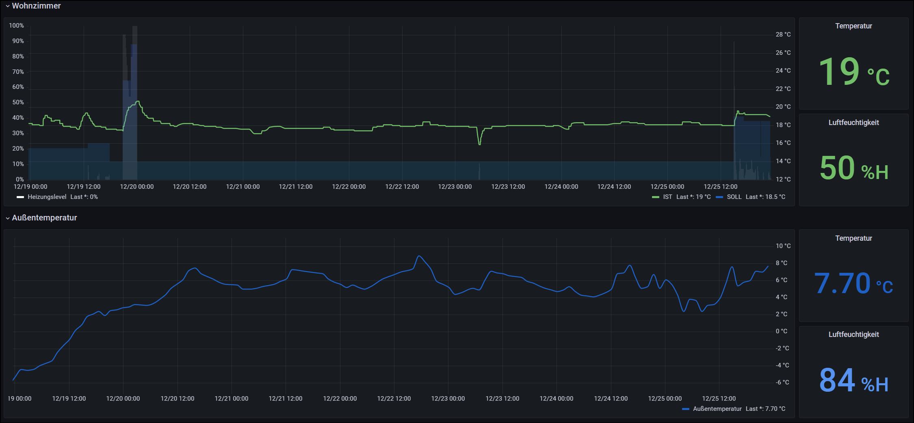
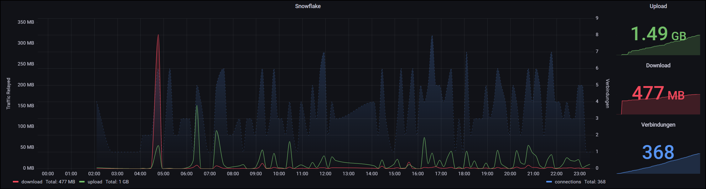

 

# Grafana
Monitoring & Visualisierung

## Home Assistant Dashboard
Exportfile: [dashboard-home-assistant.json](dashboards/dashboard-home-assistant.json)

 

Folgende Werte werden visualisiert:
* Raum IST-Temperatur
* Raum SOLL-Temperatur
* Heizungslevel
* Luftfechtigkeit

## Snowflake Dashboard
Exportfile: [dashboard-snowflake.json](dashboards/dashboard-snowflake.json)

 

Folgende Werte werden visualisiert:
* Upload in MB
* Download in MB
* Verbindungsanzahl

## Quellen
* [https://hub.docker.com/r/grafana/grafana](https://hub.docker.com/r/grafana/grafana)
* [https://grafana.com/docs/grafana/latest/setup-grafana/installation/docker/](https://grafana.com/docs/grafana/latest/setup-grafana/installation/docker/)