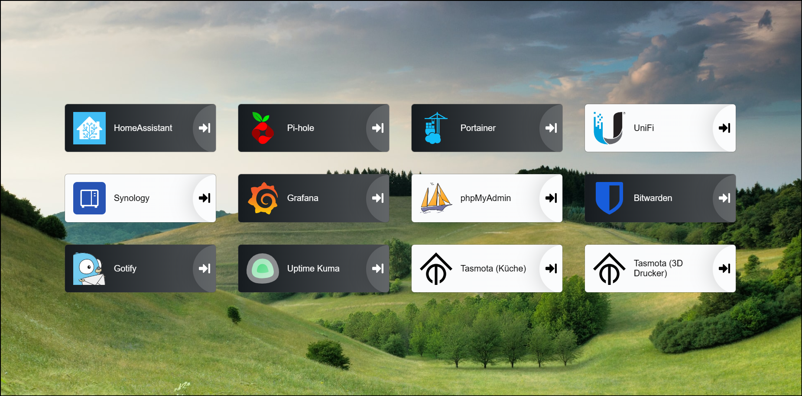

<p align="center">
<a href="https://github.com/linuxserver/Heimdall"></a><br/>
</p>

# Heimdall
Self-Hosted Dashboard

## Custom-Template

Bilder-Syntax ```bild1.jpg```,```bild2.jpg``` ..

1. Ordner ```bg``` in ```/home/erik/``` erstellen
2. Ausführen ``` docker exec -it heimdall /bin/bash```
3. Ordner ```bg``` in ```/app/www/public/img/``` erstellen
4. Container-terminal beenden```exit```
5. Bilder kopieren zum Server ```C:\Users\erik\Desktop\UnsplashBilder\* Docker-Pi-2:/home/erik/bg``` (Ordner bg chmod 777)
6. In den Container kopieren ```docker cp . heimdall:/app/www/public/img/bg```

### CSS
``` css
/* Stil für das Loader-Element */
#loader {
    position: fixed;                        /* Positioniert das Element fixiert im Browserfenster */
    top: 0;                                 /* Abstand zum oberen Rand */
    left: 0;                                /* Abstand zum linken Rand */
    width: 100%;                            /* Volle Breite des Browserfensters */
    height: 100%;                           /* Volle Höhe des Browserfensters */
    background-color: #fff;                 /* Hintergrundfarbe des Loaders */
    z-index: 9999;                          /* Stacking-Index, um den Loader über anderen Inhalten zu platzieren */
    opacity: 1;                             /* Anfangsopazität des Loaders */
    transition: opacity 0.5s ease-in-out;   /* Übergang der Opazität mit 0.5 Sekunden Dauer und Easing */
}

/* Stil für das HTML-Element mit der ID "app" */
#app {
    width: 100%;                            /* Volle Breite des Elements */
    background-position: bottom !important; /* Position des Hintergrundbilds unten am Element */
    background-repeat: no-repeat !important;/* Keine Wiederholung des Hintergrundbilds */
    background-size: cover !important;      /* Bildgröße anpassen, um das Element zu füllen */
    opacity: 0;                             /* Anfangsopazität des Elements */
    transition: opacity 0.5s ease-in-out;   /* Übergang der Opazität mit 0.5 Sekunden Dauer und Easing */
}

/* Zeige den Inhalt nach dem Laden des Hintergrundbilds an */
#app.loaded {
    opacity: 1;                             /* Stelle die Opazität auf 1, um den Inhalt anzuzeigen */
}

/* Verstecke den vertikalen Scrollbalken */
body::-webkit-scrollbar {
    width: 0.01em;                          /* Breite des Scrollbalkens */
    background-color: transparent;          /* Hintergrundfarbe des Scrollbalkens */
}

body::-webkit-scrollbar-thumb {
    background-color: transparent;          /* Farbe des Scrollbalken-Thumb */
}

```
### JavaSkript
``` JavaScript
// Warte, bis das DOM (Document Object Model) vollständig geladen ist
document.addEventListener("DOMContentLoaded", function() {
    // Erhalte eine Referenz auf das HTML-Element mit der ID "app"
    var appElement = document.getElementById("app");
    
    // Erhalte eine Referenz auf das HTML-Element mit der ID "loader"
    var loaderElement = document.getElementById("loader");

    // Generiere eine zufällige Nummer zwischen 1 und 100 für das Bild
    var randomImageIndex = Math.floor(Math.random() * 100) + 1;
    
    // Erzeuge die URL für das zufällige Hintergrundbild
    var imageUrl = "../img/bg/bild" + randomImageIndex + ".jpg";

    // Erzeuge ein neues Bildobjekt
    var bgImage = new Image();
    
    // Setze die Bildquelle auf die generierte URL
    bgImage.src = imageUrl;

    // Warte, bis das Bild vollständig geladen ist
    bgImage.onload = function() {
        // Setze die Hintergrundbild-URL für das "app"-Element mit !important
        appElement.style.setProperty("background-image", "url('" + imageUrl + "')", "important");
        
        // Füge dem "app"-Element die Klasse "loaded" hinzu
        appElement.classList.add("loaded");
        
        // Setze die Opazität des "loader"-Elements auf 0, um es auszublenden
        loaderElement.style.opacity = "0";
    };
});

```
## Quellen

* [https://github.com/linuxserver/Heimdall](https://github.com/linuxserver/Heimdall)
* [https://heimdall.site/](https://heimdall.site/)
* [https://hub.docker.com/r/linuxserver/heimdall/](https://hub.docker.com/r/linuxserver/heimdall/)