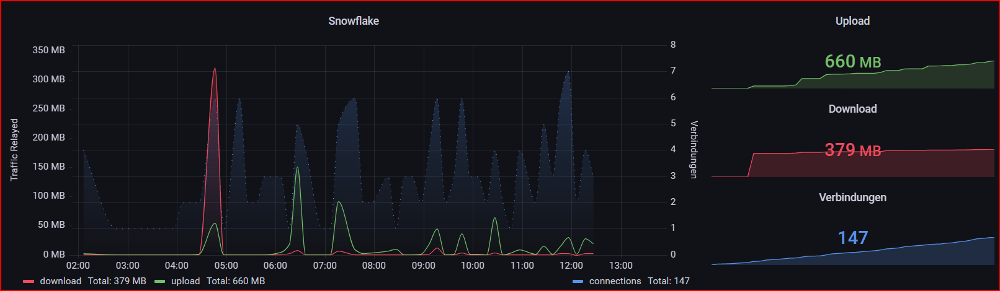

<p align="center">
<a href="https://snowflake.torproject.org/"></a><br/>
</p>

# Snowflake
Tor-Proxy: ermöglicht Menschen, trotz Netzsperren auf das Internet zuzugreifen

## Snowflake Monitoring (MariaDB+Grafana)
Mit diesem Skript werden die Logdaten alle 10min an eine MariaDB gesendet, um z.B. diese mit Grafana auszuwerten.

</br>
Grafana-Dashboard herunterladen: [dashboard-snowflake.json](https://github.com/ErikSlevin/docker/blob/main/grafana/dashboards/dashboard-snowflake.json)


### Anleitung
User und Datenbank in MariaDB anlegen

``` sql
sudo docker exec -it mariadb /bin/bash                                              /* Verbindung zum MariaDB Docker */
mysql -u root -p[Passwort]                                                          /* MariaDB Root Passwort */

create database datenbankname;                                                      /* Datenbankname */
show databases;

create user 'Benutzer'@'%' identified by 'Password';                                /* Benutzername und Passwort */   
select user, host, plugin from mysql.user;

grant all privileges on datenbankname.* to 'Benutzer'@'%' identified by 'Passwort'; /* Datenbankname, Benutzername und Passwort */
flush privileges;

show grants for 'Benutzer'@'%';                                                     
```

Benötigte Abhängigkeiten installieren: `sudo pip3 install mariadb`

MariaDB Verbindungsdaten in [snowflake-mariadb.py](snowflake-mariadb.py) ändern:

``` python
conn = mariadb.connect(
  user="User",              # User
  password="Password",      # Password
  host="127.0.0.1",         # MariaDB IP-Adresse (oder localhost)
  database="datenbankname"  # Datenbank
)
```

Skript ausführbar machen
```sudo chmod +x /path/to/snowflake-mariadb.py```

Alle 10min die Zusammenfassung an die Datenbank senden.

``` shell
sudo crontab -e
*/10 * * * * /usr/bin/python /path/to/snowflake-mariadb.py >> /path/to/logfile.log 2>&1 
```

## Quellen:
* [https://www.youtube.com/watch?v=3FjRPNzpluY](https://www.youtube.com/watch?v=3FjRPNzpluY)
* [https://gitlab.torproject.org/tpo/anti-censorship/docker-snowflake-proxy](https://gitlab.torproject.org/tpo/anti-censorship/docker-snowflake-proxy)
* [http://java.xrheingauerx.de/mariadb_datenbank_anlegen_benutzer_berechtigen.html](http://java.xrheingauerx.de/mariadb_datenbank_anlegen_benutzer_berechtigen.html)
* [https://stackoverflow.com/questions/68207037/how-to-connect-to-mariadb-by-means-of-python](https://stackoverflow.com/questions/68207037/how-to-connect-to-mariadb-by-means-of-python)
* [https://blog.veloc1ty.de/2022/09/28-running-tor-snowflake-proxy-in-docker/](https://blog.veloc1ty.de/2022/09/28-running-tor-snowflake-proxy-in-docker/)